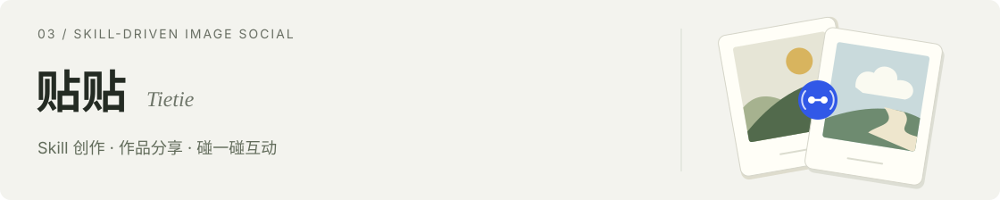

BAI YIFAN / PRODUCT PORTFOLIO

# 白一帆

**AI 产品经理** · 关注 AI 创作工具与日常表达。

这里是我的三个产品，以及研究、学习和写作中积累的 AI 工作流。

[完整作品集 ↗](https://1298335431-hub.github.io/laobai-Personal-website/)　 [1298335431@qq.com ↗](mailto:1298335431@qq.com)

## 个人项目

**梦卡**（原「看山说梦」）曾作为作品参加知乎活动，把零散的梦境片段整理成可确认的梦象、参考性解读与一张可以保存的梦卡。

产品重点：先让用户确认梦象，再进入解读与生成，让记录自然走向表达。

[查看源码 ↗](https://github.com/1298335431-hub/lucidream)　 [在线体验 ↗](https://seoshulk2a6fn66jib6rs.apigateway-cn-beijing.volceapi.com/)

 

**MeetingPrep**把 PRD、历史讨论和日历信息整理成可核对原文的会前 Brief，帮助团队更快了解背景、分歧与待决问题。

产品重点：支持飞书文档与日历只读接入，用来源、行号和原文引文降低 AI 整理结果的核对成本。

[查看源码 ↗](https://github.com/1298335431-hub/meeting-prep)　 [在线体验 ↗](https://s5gpjstgrhrpqd54s6976.apigateway-cn-beijing.volceapi.com/) 需邀请码

 

**贴贴**是一个以图片作品为社交媒介的轻社交产品。用户先选择开源 Skill 完成创作与修改，再通过作品分享和“碰一碰”产生互动。

产品重点：把 Skill 作为创作入口，把图片作品作为社交媒介，串起生成、修改、分享与互动。

[查看源码 ↗](https://github.com/1298335431-hub/tietie)　 [内测体验 ↗](https://sv47l1ha6bddrf233tutq.apigateway-cn-beijing.volceapi.com/) 需邀请码

## 工具与实践

- [**竞品研究**](https://github.com/1298335431-hub/Skills/tree/main/competitive-analysis) · 从问题澄清、资料核验到竞品对比。
- [**英语陪练**](https://github.com/1298335431-hub/learn-spoken-english) · 双语解释、情境练习与逐轮反馈。
- [**中文写作**](https://github.com/1298335431-hub/Skills/tree/main/human-writing-editorial) · 材料检查、表达整理与文本规则复核。

 

欢迎交流产品实践与工作机会 · <a href="mailto:1298335431@qq.com">1298335431@qq.com</a> · <a href="https://github.com/1298335431-hub/Skills">更多 Skills ↗</a>
