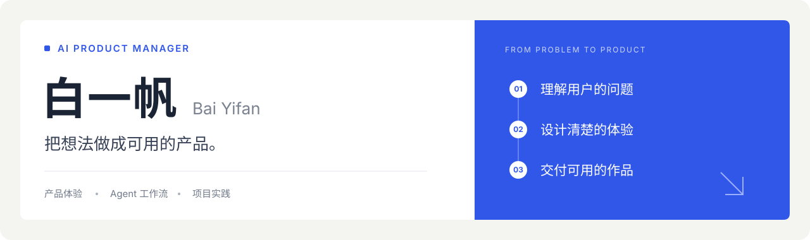
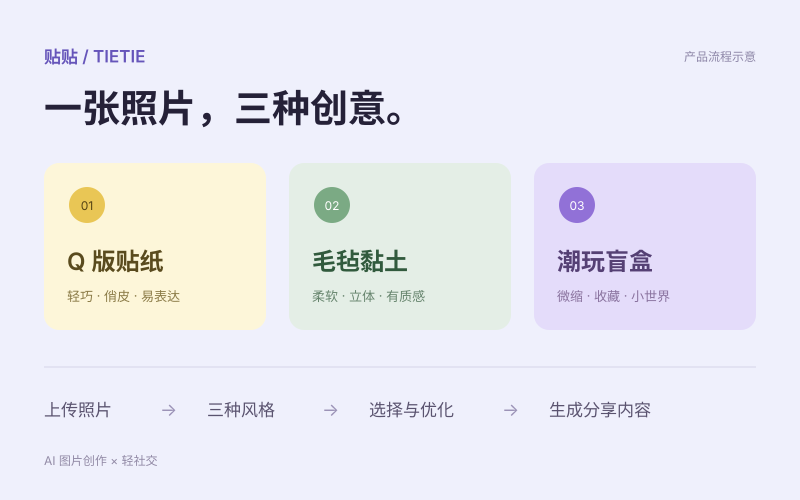

<a href="https://1298335431-hub.github.io/laobai-Personal-website/"><strong>浏览完整作品集 ↗</strong></a>　 · 　<a href="mailto:1298335431@qq.com">联系我 ↗</a>

## 01　个人项目

<table>
<tr>
<td width="50%" valign="top">

<h3>贴贴 · Tietie</h3>

<strong>一张照片，三种创意。</strong>

邀请制 AI 图片创作与轻社交产品。上传照片后生成不同风格，选定一张成片，再用自然语言优化，生成可编辑的分享内容。

<strong>设计重点</strong> 把图片识别、风格选择、反馈修改和分享衔接成清楚的创作流程。

<a href="https://sv47l1ha6bddrf233tutq.apigateway-cn-beijing.volceapi.com/"><strong>内测体验 ↗</strong></a> · 需邀请码

</td>
<td width="50%" valign="top">

<h3>看山说梦 · LUCIDREAM</h3>

<strong>把梦境，留作一张卡。</strong>

AI 梦境解读与梦卡创作产品。记录醒来时的片段，确认梦象，再生成参考性解读与梦卡，支持下载和分享准备。

<strong>设计重点</strong> 先让用户校正梦象，再进入生成；用梦卡承接记录、自我表达与分享。

<a href="https://seoshulk2a6fn66jib6rs.apigateway-cn-beijing.volceapi.com/"><strong>在线体验 ↗</strong></a> · <a href="https://github.com/1298335431-hub/lucidream">项目源码</a>

</td>
</tr>
</table>

## 02　工具与实践

把研究和学习中的重复任务，整理成有明确输入、步骤与输出的 Skills。

| 实践 | 设计思路 | 查看 |
| :--- | :--- | :--- |
| **竞品研究** | 澄清用户与场景 → 核验竞品信息 → 形成对比与建议 | [研究工作流](https://github.com/1298335431-hub/Skills/tree/main/competitive-analysis) |
| **英语陪练** | 双语解释 → 情境练习 → 逐轮反馈与迁移 | [学习工作流](https://github.com/1298335431-hub/learn-spoken-english) |
| **中文写作** | 检查材料 → 组织表达 → 事实与文本规则复核 | [写作流程](https://github.com/1298335431-hub/Skills/tree/main/human-writing-editorial) · [Python 检查器](https://github.com/1298335431-hub/Skills/blob/main/human-writing-editorial/scripts/check_prose.py) |

[**浏览 Skills 工具集 →**](https://github.com/1298335431-hub/Skills)

---

**白一帆 · AI 产品经理**  
关注具体的用户场景、清楚的交互路径，以及能够体验和验证的交付物。

欢迎交流产品实践与工作机会。**[1298335431@qq.com](mailto:1298335431@qq.com)**
