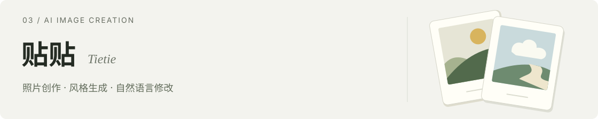

BAI YIFAN / PRODUCT PORTFOLIO

# 白一帆

**AI 产品经理** · 关注 AI 创作工具与日常表达。

这里是我的两个产品，以及研究、学习和写作中积累的 AI 工作流。

[完整作品集 ↗](https://1298335431-hub.github.io/laobai-Personal-website/)　 [邮件联系 ↗](mailto:1298335431@qq.com)

## 个人项目

**贴贴**让一张照片变成不同风格的作品，再用自然语言修改，整理成可编辑的图文分享内容。

产品重点：用三种明确的风格降低创作门槛，保留生成之后的选择与修改。

[查看源码 ↗](https://github.com/1298335431-hub/tietie)　 [内测体验 ↗](https://sv47l1ha6bddrf233tutq.apigateway-cn-beijing.volceapi.com/) 需邀请码

 

**看山说梦**把零散的梦境片段，整理成可确认的梦象、参考性解读与一张可以保存的梦卡。

产品重点：先让用户确认梦象，再进入解读与生成，让记录自然走向表达。

[查看源码 ↗](https://github.com/1298335431-hub/lucidream)　 [在线体验 ↗](https://seoshulk2a6fn66jib6rs.apigateway-cn-beijing.volceapi.com/)

## 工具与实践

- [**竞品研究**](https://github.com/1298335431-hub/Skills/tree/main/competitive-analysis) · 从问题澄清、资料核验到竞品对比。
- [**英语陪练**](https://github.com/1298335431-hub/learn-spoken-english) · 双语解释、情境练习与逐轮反馈。
- [**中文写作**](https://github.com/1298335431-hub/Skills/tree/main/human-writing-editorial) · 材料检查、表达整理与文本规则复核。

 

欢迎交流产品实践与工作机会 · <a href="mailto:1298335431@qq.com">1298335431@qq.com</a> · <a href="https://github.com/1298335431-hub/Skills">更多 Skills ↗</a>
